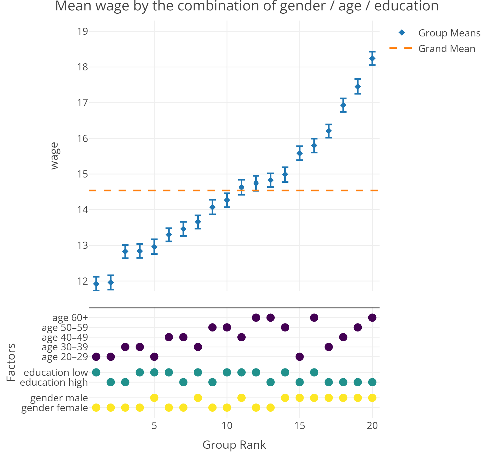

---
title: "Introduction to mfcurve"
output: rmarkdown::html_vignette
vignette: >
  %\VignetteIndexEntry{Introduction to mfcurve}
  %\VignetteEngine{knitr::rmarkdown}
  %\VignetteEncoding{UTF-8}
---

```{r, include = FALSE}
knitr::opts_chunk$set(
  collapse = TRUE,
  comment = "#>"
)
```

# mfcurve: Visualizing Multifactorial Research Designs


## Motivation

Experimental research designs often combine multiple treatments. A medical trial, for instance, might simultaneously study patient health depending on which drug is administered (e.g., A, B, or C) *and* at what dose (low or high). While such designs are useful for studying joint treatment effects, they generate a growing number of unique treatment combinations, which are difficult to visualize. In the example above, the number of unique combinations is still manageable (3 drugs × 2 doses = 6 combinations) but it grows exponentially as additional treatments (e.g., setup: single vs. double-blind) and treatment levels (e.g., drugs D and E) are introduced. In the social sciences, where multifactorial research designs typically come as survey or choice experiments, the number of distinct treatment conditions can easily reach the hundreds or thousands.

This poses a challenge for researchers: How can they visualize results from multifactorial research designs effectively and comprehensively? `mfcurve` is designed to solve this problem.


## What is an mfcurve?

An `mfcurve` is a graph that consists of two panels:

- The **top panel** displays the mean outcome for each experimental condition, arranged in ascending order and optionally accompanied by confidence intervals and significance markers.

- The **bottom panel** shows which factor levels define each experimental condition. Colored markers indicate whether a given factor level is present or absent in the respective condition.

This layout has two advantages: First, it allows researchers to present the full range of outcome values across all treatment groups in the top panel. Second, it captures treatment effects. For this, consider the bottom panel: If dots horizontally cluster, the treatment factor is associated with systematically smaller or larger outcomes, i.e., exhibits a treatment effect.


mfcurve uses the graphing library `plotly` for its visualisation. `plotly` enables fully interactive graphics that allow users to explore their data in a variety of ways.  Users can hover over group means to access detailed information about group sizes, outcome values, and confidence intervals.


## Installation

You can install the stable release of `mfcurve` from CRAN:
```{r, eval = FALSE}
install.packages("mfcurve")
```

To access the development version with the latest features and fixes, install the package from GitHub:
```{r, eval = FALSE}
# If devtools is not already installed
install.packages("devtools")

# Install the mfcurve development version from GitHub
devtools::install_github("XAM12/mfcurve_R")
```


## Example 1: A Multifactorial Research Design
Consider a medical trial with five drugs (A-E), two doses (low vs. high), and two experimental setups (single vs. double-blind). We simulate data for this 5 × 2 × 2 design:

```{r, message=FALSE}
library(mfcurve)
library(dplyr)
set.seed(123)

# Simulate data with 1,000 observations (5 × 2 × 2 design)
df <- data.frame(
  drug = sample(c("A", "B", "C", "D", "E"), 1000, replace = TRUE),
  dose = sample(c("low", "high"), 1000, replace = TRUE),
  setup = sample(c("single-blind", "double-blind"), 1000, replace = TRUE)
)

# Simulate health outcome (1–10 scale)
df$health <- 6 +
  ifelse(df$drug == "B", 0.5,        # beneficial
  ifelse(df$drug == "E", -0.5, 0)) + # detrimental
  ifelse(df$setup == "single-blind", 0.4, 0) +  # stronger effect for single-blind
  rnorm(1000, 0, 1.2)  # noise

# Ensure values are between 1 and 10
df$health <- pmin(pmax(df$health, 1), 10)
```

Next, we plot the `mfcurve`. For this, we simply specify the dataset, outcome, and treatments:  
(*Note*: By default, `mfcurve` uses a "collased" mode to display factor level combinations in folded groups, which is most efficient for interactive graphs. Setting the mode to "expanded" ensures that all group combinations are appropriately displayed which is recommended for static graphs.)
```{r}
mfcurve(data = df, outcome = "health", factors = c("dose", "drug", "setup"), mode = "expanded")
```

```{r, include=FALSE, eval=FALSE}
# Export static graph for vignette
library(plotly)
mfcurve(df, outcome = "health", factors = c("dose", "drug", "setup"), mode = "expanded") %>%
  config(
    toImageButtonOptions = list(
      format = "png",
      filename = "example1",
      width = 600,
      height = 550,
      scale = 3
    )
  )
```

```{r, echo = FALSE, out.width = "100%"}
knitr::include_graphics("example1.png")
```

What does this `mfcurve` reveal? First, we observe that in our simulated example, participants' health scores vary considerably across the 20 treatment groups. On the left, in the unhealthiest group, participants have a mean health score of 5.25. On the right, in the healthiest group, participants reach a score of 7. Both groups clearly differ from the grand mean (dashed line), and these differences are statistically significant—as indicated by the confidence intervals and starred significance markers.  

Second, once we turn to the bottom panel, where each treatment is split into its binary components, we can identify treatment effects through visual patterns (for a similar logic, see Simonsohn et al., 2020; Krähmer & Young, forthcoming). The strategy for detecting effects is simple: Scan each row from left to right and look for discernible patterns, such as points clustering towards the right or left. If a pattern exists, it suggest that a treatment is associated with systematically larger (or smaller) values on the outcome variable. To make this more tangible, consider the first two rows in the above `mfcurve`, which indicate whether participants received a high or low drug dose. Scan these rows from left to right. No clear pattern emerges. Instead, dots appear liberally sprinkled across the rows. In fact, if we cut the panel vertically in half and count dots per row, we see that low and high doses are equally represented (i.e., five times) on each side. 

Now turn to the second set of rows, which represent which drug was administered during the trial. Here, we can spot a clear pattern. At the far left, among the unhealthiest participants, *all* patients received drug E. In other words, drug E seems to be detrimental to patients' health—precisely the effect we baked into our data simulation. Moving right, we notice that dots start jumping between treatments A, C, and D. There is no clear pattern—none of these drugs appears to be associated with better or worse health outcomes. Finally, at the far right, among the healthiest patients, *all* patients received drug B. In other words, drug B seems beneficial to patients' health—just as specified in the data-generating process. 

Turn to the last set of rows to find another treatment effect. Although the pattern is slightly less clear, the experimental setup also seems to matter. Single-blind studies generally yield better health outcomes, possibly due to experimenter or confirmation bias. Double-blind studies, on the other hand, favor worse health outcomes. 

Taken together, the `mfcurve` effectively reveals not only the full outcome range across all treatment groups but also visually conveys what treatments are most influential.  

## Example 2: Multivariate Description
A second use case for `mfcurve` is multivariate description. To illustrate this, consider a large-scale survey dataset with 8,000 observations that measures respondents' gender, age, education, and hourly wage: 

```{r, message=FALSE}
library(mfcurve)
library(dplyr)
set.seed(456)

# Simulate sociodemographic data for 8,000 observations
df <- data.frame(
  gender = sample(c("male", "female"), 8000, replace = TRUE),
  age = sample(c("20–29", "30–39", "40–49", "50–59", "60+"), 8000, replace = TRUE),
  education = sample(c("high", "low"), 8000, replace = TRUE)
)

# Define a modest linear age effect
age_effect <- c("20–29" = 0, "30–39" = 0.7, "40–49" = 1.4, "50–59" = 2.1, "60+" = 2.8)

# Generate hourly wage as a function of age, gender, and education (base wage: $12)
df$wage <- 12 +
  age_effect[df$age] +
  ifelse(df$gender == "male", 1, 0) +  # male wage premium
  ifelse(df$gender == "male" & df$education == "high", 2.5, 0) +  # differential returns to education
  rnorm(8000, 0, 2) #noise
```

We can plot an `mfcurve` for this data, too. The only difference is that we can no longer derive claims about causality given the non-randomness of gender, age, and education. 
(*Note*: setting showSigStars to FALSE declutters the graph. Due to the large sample size, almost all groups differ significantly from the grand mean.)

```{r}
mfcurve(data = df, outcome = "wage", factors = c("gender", "age", "education"), mode = "expanded", showSigStars = FALSE)
```

```{r, include=FALSE, eval=FALSE}
# Export static graph for vignette
mfcurve(df, outcome = "wage", factors = c("gender", "age", "education"), mode = "expanded", showSigStars = FALSE) %>%
  config(
    toImageButtonOptions = list(
      format = "png",
      filename = "example2",
      width = 600,
      height = 550,
      scale = 3
    )
  )
```

```{r, echo = FALSE, out.width = "100%"}

```

Just like the previous `mfcurve`, this graph succinctly conveys the overall outcome range (top panel) and relations between the outcome and other variables. Specifically, we see that older age and being male are associated with higher wages. For education, the pattern is less clear. However, if we look closely, we can spot evidence of an interaction effect. For males, education clearly pays off. Males who are highly educated (groups 15, 17-20) occupy the top positions in the wage distribution. Conversely, males with low education (groups 5, 8, 11, 14, 16) earn much less on average. What about women? For them, there is no such education premium. Females with high education (groups 2, 3, 7, 13) and females with low education (groups 1, 4, 6, 12) spread almost equally across the income distribution. Hence, they do not seem to benefit financially from higher education. 

In the context of non-experimental data, `mfcurve` does not support any causal claims. Still, it provides a crisp and engaging visualization that conveys both the distribution of a target variable and its associations with other group characteristics. As such, `mfcurve` can be a useful tool beyond the realm of experimental research designs.


## Under The Hood
`mfcurve` is a wrapper that sequentially calls `mfcurve_preprocessing()` and `mfcurve_plotting()`. While we expect that most users will find this wrapper sufficient for their needs, there may be instances where calling only one of the functions is preferable—for instance, when the dataset has been preprocessed manually and requires only plotting. For more information about `mfcurve_preprocessing()` and `mfcurve_plotting()`, please refer to the documentation.


## Customization & Options
`mfcurve` includes a few native design options, such as adding a title or plotting the origin (see documentation). Remember that `mfcurve` return a `plotly` object. This means you can customize the graph further using any standard `plotly` syntax. 


## Contributions & Licence
This package was created by Maximilian Frank, Daniel Krähmer, and Claudia Weileder. It builds on the Stata command `mfcurve` originally developed by Daniel Krähmer (see https://ideas.repec.org/c/boc/bocode/s459224.html). We welcome feedback, suggestions, and contributions! Feel free to fork the GitHub repository and submit a pull request with your changes.
This package is licensed under GNU General Public License v3.0 or later. See the LICENSE file for details.

## References
Krähmer, D., & Young, C. (forthcoming). Visualizing vastness: Graphical methods for multiverse analysis. PLOS One.

Simonsohn, U., Simmons, J. P., & Nelson, L. D. (2020). Specification curve analysis. Nature Human Behaviour, 4(11), 1208–1214. https://doi.org/10.1038/s41562-020-0912-z
