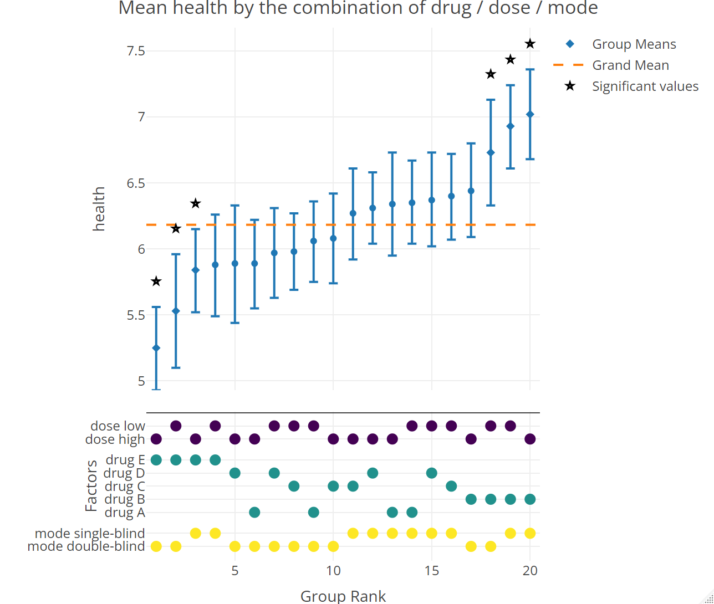

---
title: "Introduction to mfcurve"
output: rmarkdown::html_vignette
vignette: >
  %\VignetteIndexEntry{Introduction to mfcurve}
  %\VignetteEngine{knitr::rmarkdown}
  %\VignetteEncoding{UTF-8}
---

```{r, include = FALSE}
knitr::opts_chunk$set(
  collapse = TRUE,
  comment = "#>"
)
```

# mfcurve: Visualizing Multifactorial Research Designs


## Motivation

Experimental research designs often combine multiple treatments. A medical trial, for example, might study patient health depending on the drug administered (e.g., A, B, or C) and its dose (low or high). Such designs are useful for studying treatment effect heterogeneity, but they generate a large number of unique treatment combinations. While the number of unique combinations in the example above is still manageable (3 drugs × 2 doses = 6 combinations), the total quickly grows as additional treatments are introduced (e.g., blinding status: single vs. double-blind) or as treatments include more levels (e.g., drugs D and E). In the social sciences, where multifactorial designs typically appear as survey or choice experiments, the number of distinct treatment conditions can easily reach into the hundreds or thousands.

This poses a significant challenge for researchers: How can they visualize the outcome across all these different treatment conditions comprehensively and transparently? `mfcurve` is designed to provide a solution to this problem. 


## What is an mfcurve?

An `mfcurve` consists of two panels:

- The **top panel** displays the mean outcome value for each experimental condition (i.e., each unique combination of factor levels). Group means are ordered by size and can optionally be supplemented with confidence intervals and significance markers. 

- The **lower panel** shows, for each experimental condition, which factor levels define that condition. Colored markers indicate whether a given factor level was present or absent in that condition. 

This layout helps users quickly grasp the full range of outcomes across all treatment conditions. It also visualizes which specific treatments—or treatment combinations—affect the outcome: Treatments that lead to higher or lower outcomes will be characterized by markers that discernibly cluster in the bottom panel. To support further exploration, the plot is generated using `plotly`, making it fully interactive: users can hover over group means to access detailed information such as group size, mean outcome, and confidence intervals.


## Installation

You can install the stable release of `mfcurve` from CRAN:
```{r, eval = FALSE}
install.packages("mfcurve")
```

To access the development version with the latest features and fixes, install the package from GitHub:
```{r, eval = FALSE}
# If devtools is not already installed
install.packages("devtools")

# Install the mfcurve development version from GitHub
devtools::install_github("XAM12/mfcurve_R")
```


## Example 1: A Multifactorial Research Design
Consider the extended medical trial mentioned above with five drugs (A-E), two doses (low vs. high), and two blindings (single vs. double-blind). We simulate data for this 5 × 2 × 2 design, featuring 20 unique treatment conditions:

```{r}
library(mfcurve)
library(dplyr)
set.seed(123)

# Simulate data with 1,000 observations (5 × 2 × 2 design)
set.seed(123)
df <- data.frame(
  drug = sample(c("A", "B", "C", "D", "E"), 1000, replace = TRUE),
  dose = sample(c("low", "high"), 1000, replace = TRUE),
  blinding = sample(c("single-blind", "double-blind"), 1000, replace = TRUE)
)

# Simulate health outcome (1–10 scale)
df$health <- 6 +
  ifelse(df$drug == "B", 0.5,        # beneficial
  ifelse(df$drug == "E", -0.5, 0)) + # detrimental
  ifelse(df$blinding == "single-blind", 0.4, 0) +  # stronger effect for single-blind
  rnorm(1000, 0, 1.2)  # noise

# Ensure values are between 1 and 10
df$health <- pmin(pmax(df$health, 1), 10)

```


Next, we can plot the mfcurve by specifying the dataset, outcome, and factors:
```{r}
mfcurve(df, "health", c("drug", "dose", "blinding"), mode = "expanded")

```

```{r, echo = FALSE, out.width = "100%"}

```
(Note: The graph you will get when re-running this example in R is generated with `plotly` and therefore interactive.)

What does the mfcurve show? First, there is considerable variation in health outcomes across groups. [...]

## Example 2: Multivariate Description
Add second example [TBD]

## Under The Hood 
Describe/explain the two subroutines for preprocessing and plotting 

## Customization and Options

## Contributing
[remove this?]
Contributions are welcome! Please fork this repository and submit a pull request with your changes.

## License
TBD

